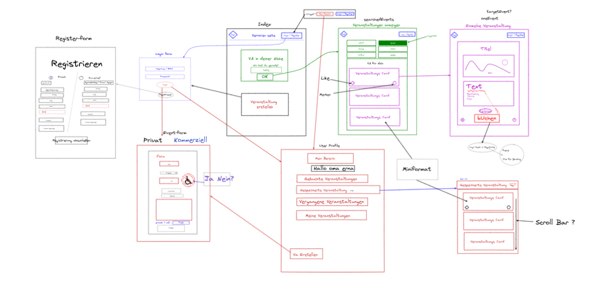
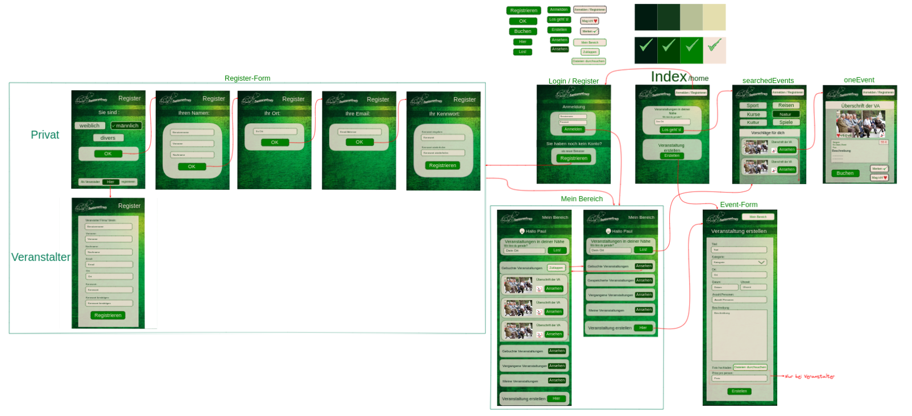

# Senioren-Treff-Full-Stack-MERN-Gruppen-Projekt

**[Test this app yourself](github.link)**

---

![Mockup how the Idea started]   
![Layout for our Website and Functions] 

#### Navigation

- About Project
  - _Description_
- How to use this Project
  - _Description_
- Developed With
- Contact
  - _GitHub_
- Used Tools
  - _Fonts_
  - _Design_
  - _Icons_
  - _Colors_

---

### About Project

Step by step creation of an old people event App

### How to use this Project

In back- & front folder type in this command:

<pre><code>npm install</code></pre>

##### Developed With

- [x] _HTML5_
- [x] _CSS3_
- [ ] _SASS_
- [x] _SCSS_
- [x] _JavaScript_
- [x] _React_
- [x] _npm_
- [x] _node_
- [x] _mongoose_
- [x] _axios_

---

### Contact

GitHub: <https://github.com/DennisPiecha>
GitHub: <https://github.com/Tom-Necke>
GitHub: <https://github.com/saby-gaby>
GitHub: <https://github.com/Holledrums>

---

### Used Tools

- [icons](https://)
- [excalidraw](https://excalidraw.com/#room=fe633d02fd4a46cc1dc0,ODbm7jX1aPKXrCksAoHAeA)
- [npm](https://www.npmjs.com/)
- [google.presentation](https://docs.google.com/presentation/d/1Xq9_OY2YEIlT-Q83_-bZsbpGEH6M-wsvAVpsRcDM5Ss/edit#slide=id.p)
- [Google Fonts](https://fonts.google.com/)
- [Visual Studio Code](https://code.visualstudio.com/)
- [ColorZilla](https://www.colorzilla.com/chrome/)

---

Made with ❤️❤️❤️ by Sabina, Holger, Tom & Dennis ❤️❤️❤️
